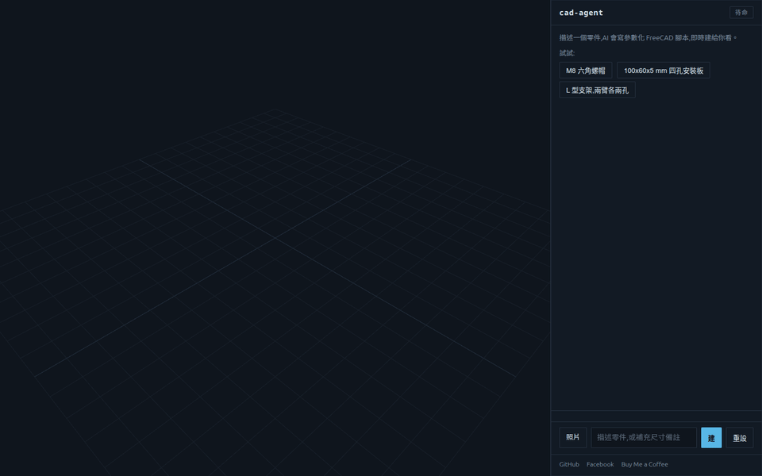
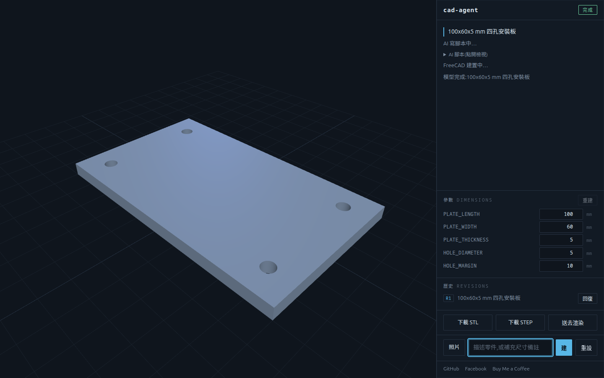
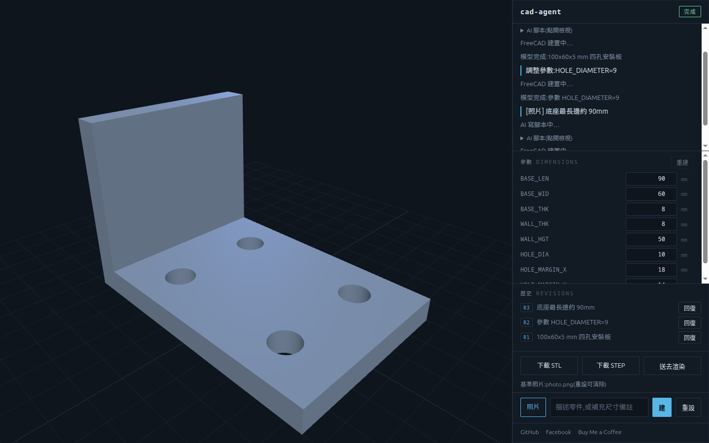

# cad-agent

**Describe a part in plain language — or upload a photo of a real one — and
watch AI build it into a parametric CAD model, live.**



[](https://github.com/yazelin/cad-agent/actions/workflows/ci.yml)
[](LICENSE)


> 正體中文導讀：用一句話（或一張實物照片）描述零件，AI 寫出參數化 FreeCAD
> 腳本、無頭建置，瀏覽器即時看 3D 結果。尺寸都是腳本頂端的大寫變數：在參數
> 面板直接改數字，幾秒重建，不用再等 AI。可下載 STL/STEP，建置歷史能回到
> 任一版本繼續改。這是給我自己用的工具，也是「AI 寫 CAD」跑得起來的示範。

An AI writes a parametric FreeCAD script, runs it headless, and shows the
resulting 3D model live in your browser. Say "make it longer" and it edits a
parameter and rebuilds.

This is the modeling stage of a two-tool pipeline: **FreeCAD builds the part**
(manufacturable, parametric), and Blender renders the product image (see
[render-studio](https://github.com/yazelin/render-studio)). cad-agent runs
fully standalone.

## Features

- **Live progress** — thinking / building / self-repair stages stream to the
  browser as they happen; no more staring at a frozen button.
- **Parameter panel** — every dimension the AI writes becomes an editable
  field. Change a number and FreeCAD rebuilds in seconds, no AI round-trip.
- **STL / STEP downloads** — the output of a CAD tool is the file.
- **Build history** — every successful build is a revision (R1, R2, …);
  restore any earlier one and continue from it.
- **Photo to CAD** — photograph a real part, get a parametric reconstruction.
- **Feature-level iteration** — a follow-up like "round the top four edges R3" or
  "chamfer this edge C2" adds one small step (FreeCAD `makeFillet` / `makeChamfer`)
  onto the working script and keeps the rest verbatim, instead of regenerating the
  whole part. Small edits stay robust where a one-shot rewrite is fragile.
- **Self-repair** — build errors are fed back to the model (up to 2 retries).



## How it works

```
browser (three.js viewer + chat + SSE)
  | localhost
FastAPI backend
  |- brain:  claude -p (subprocess)  -> a parametric FreeCAD Python script
  |- runner: freecadcmd (sandboxed scratch dir, timeout, scrubbed env)
  |            the script exports out.stl + out.step
  |- SSE:    pushes the script text, then the STL url, to the browser
browser reloads the mesh on each build (live, step-by-step)
```

The script keeps every dimension as an UPPERCASE variable at the top, so an edit
("the legs are too long") is one parameter change and a re-run, not a rewrite.
When a build fails, the error is fed back to the model to self-repair (up to 2
retries).

## Photo to CAD

Upload a photo of a physical part (optionally add a hint with a known dimension
or note) and the model reverse-engineers it into a parametric FreeCAD script,
then the same build / preview / edit loop takes over.



- **Object selection works on cluttered photos.** Point at one item with a hint
  ("the central hex nut", "the square plate with four corner holes at the
  top-right") and it models that one. Verified: from a single photo of six mixed
  fasteners, pointing at three different parts produced three correct, distinct
  models — never the wrong one.
- **Photo-aware iteration.** The session remembers the photo, so a later text
  refinement ("make sure every arm has two holes") re-sees the part *and* the
  previous script together. `重設` clears it; a new upload starts a fresh part.
- A known dimension in the hint sets the scale; without one, proportions are
  estimated.

What it does well: primitive-decomposable mechanical parts — boxes, cylinders,
hex prisms, holes, rounded ends, L-folds — reconstructed with correct structure.
What it only approximates: exact dimensions without a hint, organic/freeform
surfaces, threads, and gear teeth (a thread becomes a smooth cylinder). Single
photo, so hidden faces are inferred. It is structural reverse-engineering, not a
pixel-faithful copy.

## Requirements

- Python 3.11+
- [FreeCAD](https://www.freecad.org/) providing a headless binary
  (`freecadcmd` from apt, or `freecad.cmd` from the snap — auto-detected)
- The [`claude`](https://docs.claude.com/en/docs/claude-code) CLI, logged in
  (the brain runs `claude -p`, so it uses your subscription, not the API)

## Install

```bash
git clone <this-repo> cad-agent && cd cad-agent
python -m venv .venv && . .venv/bin/activate   # or: uv venv && . .venv/bin/activate
pip install -e ".[dev]"                          # or: uv pip install -e ".[dev]"
```

## Run

```bash
python -m cad_agent
# open http://127.0.0.1:8099, describe a part (or upload a photo), click 建
```

## Configuration

| Env var | Default | Purpose |
|---|---|---|
| `CAD_AGENT_FREECAD` | auto-detect | Force the FreeCAD binary name/path |
| `CAD_AGENT_SCRATCH` | `~/cad-agent-scratch` | Where scripts run and STL/STEP land |

The default scratch is a non-hidden directory under `$HOME` on purpose: the snap
FreeCAD has a private `/tmp` and its sandbox cannot read dotfiles, so neither
`/tmp` nor a `~/.dotdir` scratch is visible to `freecad.cmd`.

## Safety

The generated Python is run, so it is sandboxed lightly for personal single-user
use: a per-run scratch directory as the working dir, a timeout, and a scrubbed
environment (secrets are never passed to the FreeCAD subprocess). `claude -p`
runs with an allowlist of just the `Read` tool (so it can view an uploaded
photo but cannot write files, run shells, or fetch the network) and in a
throwaway directory. For multi-user or untrusted use, tighten this with
bubblewrap (`--net=none`, restricted filesystem).

## Tests

```bash
pytest            # unit tests run anywhere; the real end-to-end
                  # acceptance test auto-skips when FreeCAD is absent
```

## 作者與支持

- 原始碼 GitHub:<https://github.com/yazelin/cad-agent>
- Facebook:<https://www.facebook.com/yaze.lin.gm>
- Buy Me a Coffee:<https://buymeacoffee.com/yazelin>

## License

MIT (c) 林亞澤
